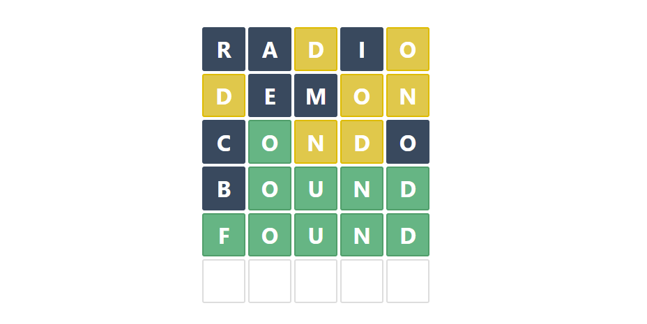

# Wordle

This game is my own adaptation of the original [Wordle](https://www.powerlanguage.co.uk/wordle/) game developed by [Josh Wardle](https://www.powerlanguage.co.uk/).

[](https://wordle.bonavida.dev)

Website: https://wordle.bonavida.dev

## Tech

- Vue
- Nuxt.js
- TypeScript

## Development

If you want to run it locally, you just need to install all the dependencies

```bash
yarn install
```

and then, run the application in development mode.

```bash
yarn dev
```

## ToDo features

- Use an API to fetch the daily word and to check if the guess is a valid word
- Dark mode
- Try words with different length (up to 10 letters)
- i18n
